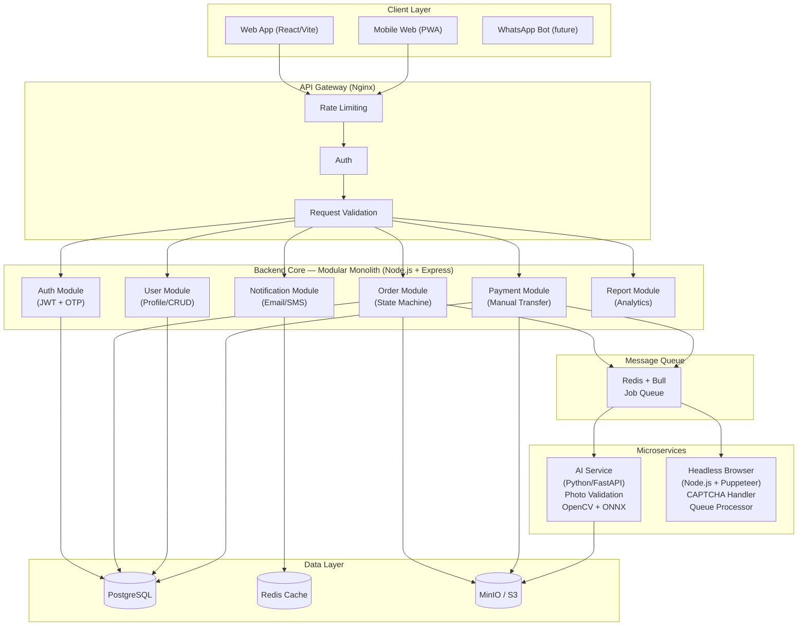
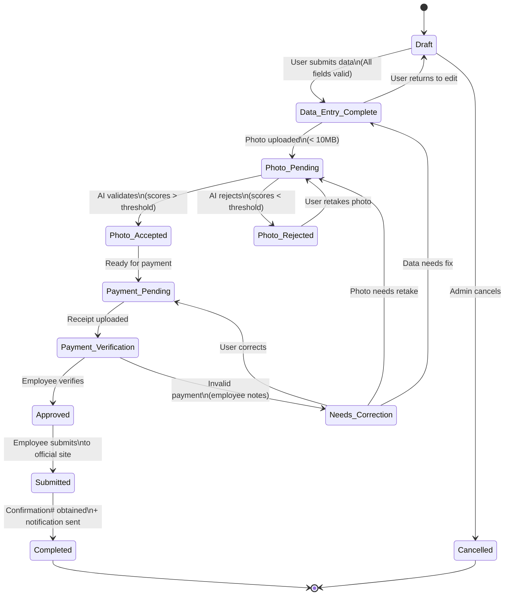
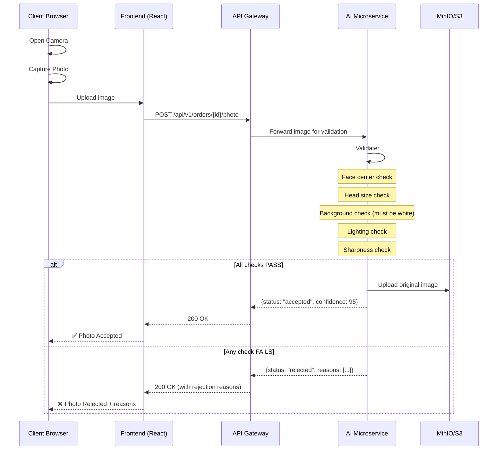
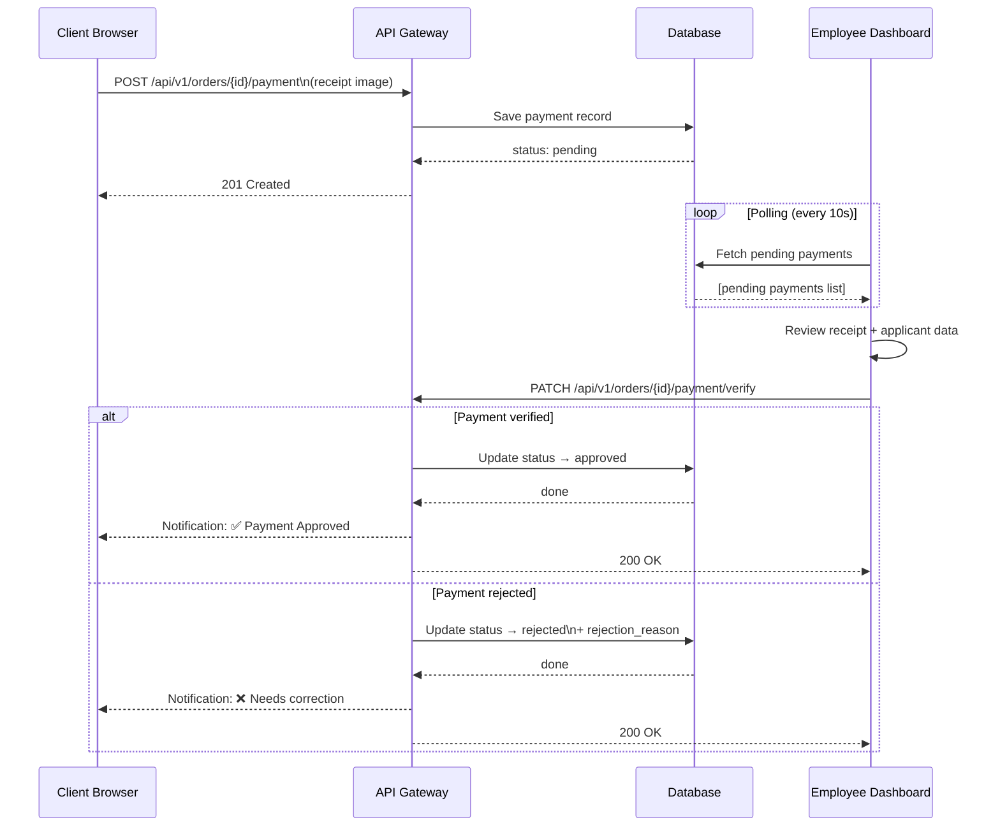
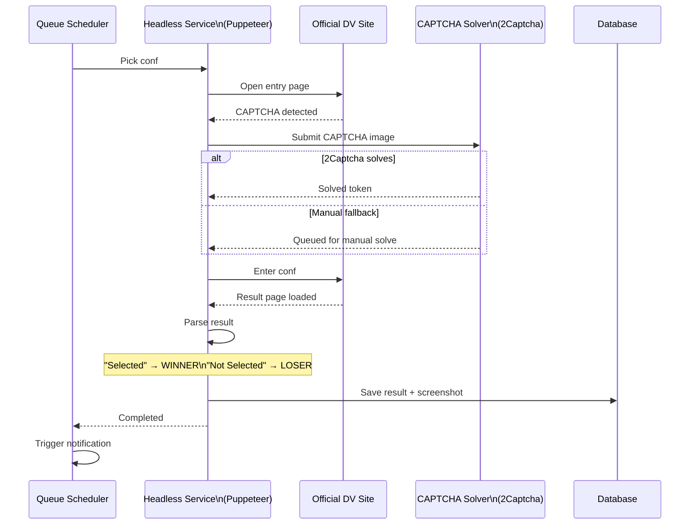

# معمارية النظام وتصميم الواجهة الخلفية

## 1. High-Level Architecture



---

## 2. Entity Relationship Diagram (ERD)

### Core Tables

```sql
-- ========== Users Module ==========
CREATE TABLE users (
    id                UUID PRIMARY KEY DEFAULT gen_random_uuid(),
    email             VARCHAR(255) UNIQUE NOT NULL,
    phone             VARCHAR(20) UNIQUE,
    password_hash     VARCHAR(255) NOT NULL,
    full_name         VARCHAR(255),
    role              ENUM('client', 'employee', 'admin') DEFAULT 'client',
    is_verified       BOOLEAN DEFAULT FALSE,
    created_at        TIMESTAMPTZ DEFAULT NOW(),
    updated_at        TIMESTAMPTZ DEFAULT NOW()
);

-- ========== Orders Module ==========
CREATE TABLE orders (
    id                UUID PRIMARY KEY DEFAULT gen_random_uuid(),
    user_id           UUID NOT NULL REFERENCES users(id),
    service_type      VARCHAR(50) DEFAULT 'dv_lottery',
    status            ENUM(
                        'draft',
                        'data_entry_complete',
                        'photo_pending',
                        'photo_rejected',
                        'photo_accepted',
                        'payment_pending',
                        'payment_verification',
                        'needs_correction',
                        'approved',
                        'submitted',
                        'completed',
                        'cancelled'
                      ) DEFAULT 'draft',
    metadata          JSONB,
    total_price       DECIMAL(10,2),
    created_at        TIMESTAMPTZ DEFAULT NOW(),
    updated_at        TIMESTAMPTZ DEFAULT NOW()
);

-- ========== Applicant Data (DV Lottery-specific) ==========
CREATE TABLE applicant_data (
    id                UUID PRIMARY KEY DEFAULT gen_random_uuid(),
    order_id          UUID NOT NULL UNIQUE REFERENCES orders(id),
    -- Personal Info
    first_name        VARCHAR(100),
    last_name         VARCHAR(100),
    middle_name       VARCHAR(100),
    gender            ENUM('male', 'female'),
    birth_date        DATE,
    birth_country     VARCHAR(100),
    birth_city        VARCHAR(100),
    -- Contact
    email             VARCHAR(255),
    phone             VARCHAR(20),
    address           TEXT,
    -- Eligibility
    education_level   VARCHAR(100),
    marital_status    ENUM('single', 'married', 'divorced', 'widowed'),
    spouse_data       JSONB,
    children_data     JSONB,
    -- Photo
    photo_path        VARCHAR(500),  -- S3/MinIO path
    photo_validation  JSONB,         -- AI validation result
    -- Submission
    confirmation_number VARCHAR(50),
    submitted_at      TIMESTAMPTZ,
    created_at        TIMESTAMPTZ DEFAULT NOW(),
    updated_at        TIMESTAMPTZ DEFAULT NOW()
);

-- ========== Payments Module ==========
CREATE TABLE payments (
    id                UUID PRIMARY KEY DEFAULT gen_random_uuid(),
    order_id          UUID NOT NULL REFERENCES orders(id),
    amount            DECIMAL(10,2) NOT NULL,
    currency          VARCHAR(3) DEFAULT 'USD',
    method            ENUM('bank_transfer', 'cash'),
    provider          VARCHAR(50),   -- 'alkuraimi', 'jeeb', 'one_cash', 'mobile_money'
    transfer_number   VARCHAR(100),
    receipt_image_path VARCHAR(500),
    status            ENUM(
                        'pending',
                        'verified',
                        'rejected',
                        'refunded'
                      ) DEFAULT 'pending',
    verified_by       UUID REFERENCES users(id),
    verified_at       TIMESTAMPTZ,
    notes             TEXT,
    created_at        TIMESTAMPTZ DEFAULT NOW(),
    updated_at        TIMESTAMPTZ DEFAULT NOW()
);

-- ========== Audit Log ==========
CREATE TABLE audit_logs (
    id                UUID PRIMARY KEY DEFAULT gen_random_uuid(),
    order_id          UUID REFERENCES orders(id),
    user_id           UUID REFERENCES users(id),
    action            VARCHAR(100) NOT NULL,
    from_status       VARCHAR(50),
    to_status         VARCHAR(50),
    metadata          JSONB,
    ip_address        INET,
    created_at        TIMESTAMPTZ DEFAULT NOW()
);

-- ========== Notifications ==========
CREATE TABLE notifications (
    id                UUID PRIMARY KEY DEFAULT gen_random_uuid(),
    user_id           UUID NOT NULL REFERENCES users(id),
    type              ENUM('email', 'sms', 'whatsapp', 'in_app'),
    title             VARCHAR(255),
    body              TEXT,
    channel           VARCHAR(50),
    status            ENUM('pending', 'sent', 'failed', 'read') DEFAULT 'pending',
    sent_at           TIMESTAMPTZ,
    created_at        TIMESTAMPTZ DEFAULT NOW()
);

```mermaid
erDiagram
    users ||--o{ orders : "places"
    orders ||--|| applicant_data : "has"
    orders ||--o{ payments : "receives"
    orders ||--o{ audit_logs : "logs"
    users ||--o{ audit_logs : "performs"
    orders ||--o{ notifications : "triggers"
    users ||--o{ notifications : "receives"

    users {
        uuid id PK
        varchar email UK
        varchar phone UK
        varchar password_hash
        varchar full_name
        enum role "client | employee | admin"
        boolean is_verified
        boolean is_active
        timestamptz last_login_at
        jsonb metadata
        timestamptz created_at
        timestamptz updated_at
    }

    orders {
        uuid id PK
        uuid user_id FK
        enum service_type "dv_lottery"
        enum status "draft | data_entry_complete | photo_pending | photo_rejected | photo_accepted | payment_pending | payment_verification | needs_correction | approved | submitted | completed | cancelled"
        decimal total_price
        varchar currency "YER"
        jsonb metadata
        timestamptz created_at
        timestamptz updated_at
    }

    applicant_data {
        uuid id PK
        uuid order_id FK UK
        varchar first_name
        varchar last_name
        varchar middle_name
        enum gender "male | female"
        date birth_date
        varchar birth_country
        varchar birth_city
        varchar email
        varchar phone
        text address
        varchar education_level
        enum marital_status "single | married | divorced | widowed"
        jsonb spouse_data
        jsonb children_data
        varchar photo_path
        jsonb photo_validation
        varchar confirmation_number
        timestamptz submitted_at
        timestamptz created_at
        timestamptz updated_at
    }

    payments {
        uuid id PK
        uuid order_id FK
        decimal amount
        varchar currency "YER"
        enum method "deposit | wallet"
        varchar provider "kuraimi | jeeb | one_cash | mobile_money"
        varchar transfer_number
        varchar receipt_image_path
        enum status "pending | verified | rejected | refunded"
        uuid verified_by FK
        timestamptz verified_at
        text rejection_reason
        timestamptz created_at
        timestamptz updated_at
    }

    audit_logs {
        uuid id PK
        uuid order_id FK
        uuid user_id FK
        varchar action
        varchar from_status
        varchar to_status
        jsonb metadata
        inet ip_address
        text user_agent
        timestamptz created_at
    }

    notifications {
        uuid id PK
        uuid user_id FK
        uuid order_id FK
        enum type "email | sms | whatsapp | in_app"
        varchar title
        text body
        varchar channel
        enum status "pending | sent | failed | read"
        timestamptz sent_at
        timestamptz created_at
    }
```

---

## 3. State Machine: Order Lifecycle

```
                    ┌──────────┐
                    │  Draft   │
                    └────┬─────┘
                         │ (User completes data entry)
                         ▼
                 ┌───────────────┐
                 │ Data_Entry    │
                 │ Complete      │
                 └───────┬───────┘
                         │ (Photo uploaded)
                         ▼
                  ┌─────────────┐
                  │ Photo       │◄──────────────────┐
                  │ Pending     │                    │
                  └──────┬──────┘                    │
                         │ (AI Validation)           │
                     ┌───┴───┐                       │
                     │       │                       │
                     ▼       ▼                      │
              ┌─────────┐  ┌───────────┐            │
              │ Photo   │  │ Photo     │────────────┘
              │ Accepted│  │ Rejected  │ (User retakes)
              └────┬────┘  └───────────┘
                   │
                   ▼
           ┌───────────────┐
           │ Payment       │
           │ Pending       │
           └───────┬───────┘
                   │ (User uploads receipt)
                   ▼
          ┌──────────────────┐
          │ Payment          │
          │ Verification     │
          └───────┬──────────┘
                   │ (Employee verifies)
               ┌───┴───┐
               │       │
               ▼       ▼
        ┌─────────┐  ┌─────────────┐
        │ Approved │  │ Needs       │
        │          │  │ Correction  │
        └────┬─────┘  └──────┬──────┘
             │               │ (Returns to Draft)
             ▼               │
      ┌──────────────┐       │
      │ Submitted    │       │
      │ (Employee    │       │
      │  enters data │       │
      │  + Conf#)    │       │
      └──────┬───────┘       │
             │               │
             ▼               │
      ┌──────────────┐       │
      │ Completed    │◄──────┘
      └──────────────┘
```

### 3.1 Mermaid State Machine Diagram



### 3.2 ASCII State Machine Diagram

| From | To | Trigger | Guard Condition | Action |
|------|----|---------|-----------------|--------|
| Draft | Data_Entry_Complete | User submits data | All required fields valid | Save data, notify user |
| Data_Entry_Complete | Photo_Pending | Photo upload initiated | File size < 10MB | Upload to S3, enqueue AI job |
| Photo_Pending | Photo_Accepted | AI validation success | AI scores > threshold | Save validation result |
| Photo_Pending | Photo_Rejected | AI validation fail | AI scores < threshold | Save rejection reason, notify user |
| Photo_Rejected | Photo_Pending | User retakes photo | -- | Delete old photo, upload new |
| Photo_Accepted | Payment_Pending | Order ready for payment | Photo accepted | Show payment instructions |
| Payment_Pending | Payment_Verification | Receipt uploaded | File attached | Upload to S3, notify employees |
| Payment_Verification | Approved | Employee verifies | Transfer valid | Save verification, notify user |
| Payment_Verification | Needs_Correction | Invalid payment | Notes provided | Return to user with feedback |
| Needs_Correction | Payment_Pending | User corrects | -- | Reset payment state |
| Approved | Submitted | Employee submits to official site | Confirmation# obtained | Save Conf#, update status |
| Submitted | Completed | User notified | -- | Send notification |
| Any(*) | Cancelled | Admin action | Permission check | Audit log |

---

## 4. Sequence Diagrams

### 4.1 Photo Capture & AI Validation



### 4.2 Payment Verification Flow



### 4.3 Result Checking (Headless Browser)



---

## 5. RESTful API Design

### Base URL: `/api/v1`

#### Auth Endpoints
| Method | Endpoint | Description | Auth |
|--------|----------|-------------|------|
| POST | `/auth/register` | Register new user | No |
| POST | `/auth/login` | Login (email/phone) | No |
| POST | `/auth/verify-otp` | Verify OTP | No |
| POST | `/auth/refresh` | Refresh JWT token | Yes |

#### User Endpoints
| Method | Endpoint | Description | Auth | Role |
|--------|----------|-------------|------|------|
| GET | `/users/me` | Get current profile | Yes | All |
| PATCH | `/users/me` | Update profile | Yes | All |
| GET | `/users/{id}` | Get user by ID | Yes | Admin/Employee |

#### Orders Endpoints
| Method | Endpoint | Description | Auth | Role |
|--------|----------|-------------|------|------|
| POST | `/orders` | Create new order | Yes | Client |
| GET | `/orders` | List user's orders | Yes | All |
| GET | `/orders/{id}` | Get order details | Yes | All* |
| PATCH | `/orders/{id}/data` | Save applicant data (auto-save) | Yes | Client |
| PATCH | `/orders/{id}/status` | Change order status | Yes | Employee/Admin |

#### Photo Endpoints
| Method | Endpoint | Description | Auth | Role |
|--------|----------|-------------|------|------|
| POST | `/orders/{id}/photo` | Upload/capture photo | Yes | Client |
| GET | `/orders/{id}/photo` | Get photo + validation result | Yes | All* |

#### Payment Endpoints
| Method | Endpoint | Description | Auth | Role |
|--------|----------|-------------|------|------|
| POST | `/orders/{id}/payment` | Submit payment receipt | Yes | Client |
| GET | `/orders/{id}/payment` | Get payment status | Yes | All* |
| PATCH | `/orders/{id}/payment/verify` | Verify payment | Yes | Employee/Admin |

#### Admin/Employee Endpoints
| Method | Endpoint | Description | Auth | Role |
|--------|----------|-------------|------|------|
| GET | `/admin/orders` | List all orders (filters) | Yes | Employee/Admin |
| GET | `/admin/orders/stats` | Dashboard statistics | Yes | Admin |
| PATCH | `/admin/orders/{id}/submit` | Submit to official site + save Conf# | Yes | Employee |
| POST | `/admin/check-result` | Trigger result check for order | Yes | Admin |

#### Notification Endpoints
| Method | Endpoint | Description | Auth | Role |
|--------|----------|-------------|------|------|
| GET | `/notifications` | List user notifications | Yes | All |
| PATCH | `/notifications/{id}/read` | Mark as read | Yes | All |

---
