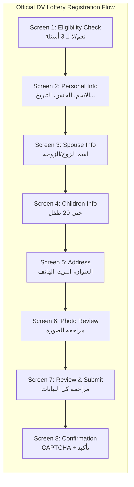
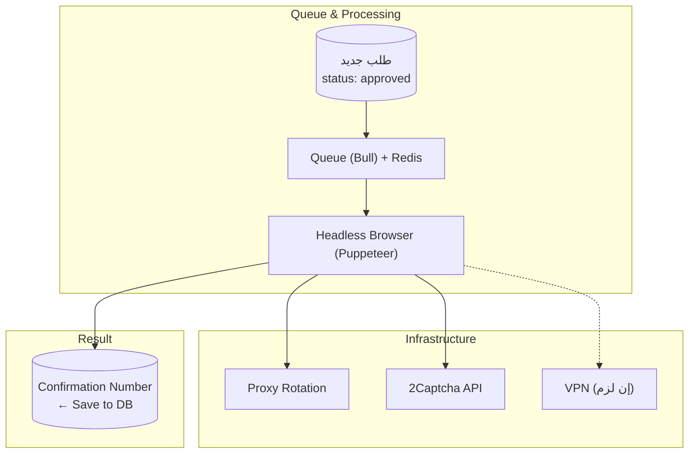
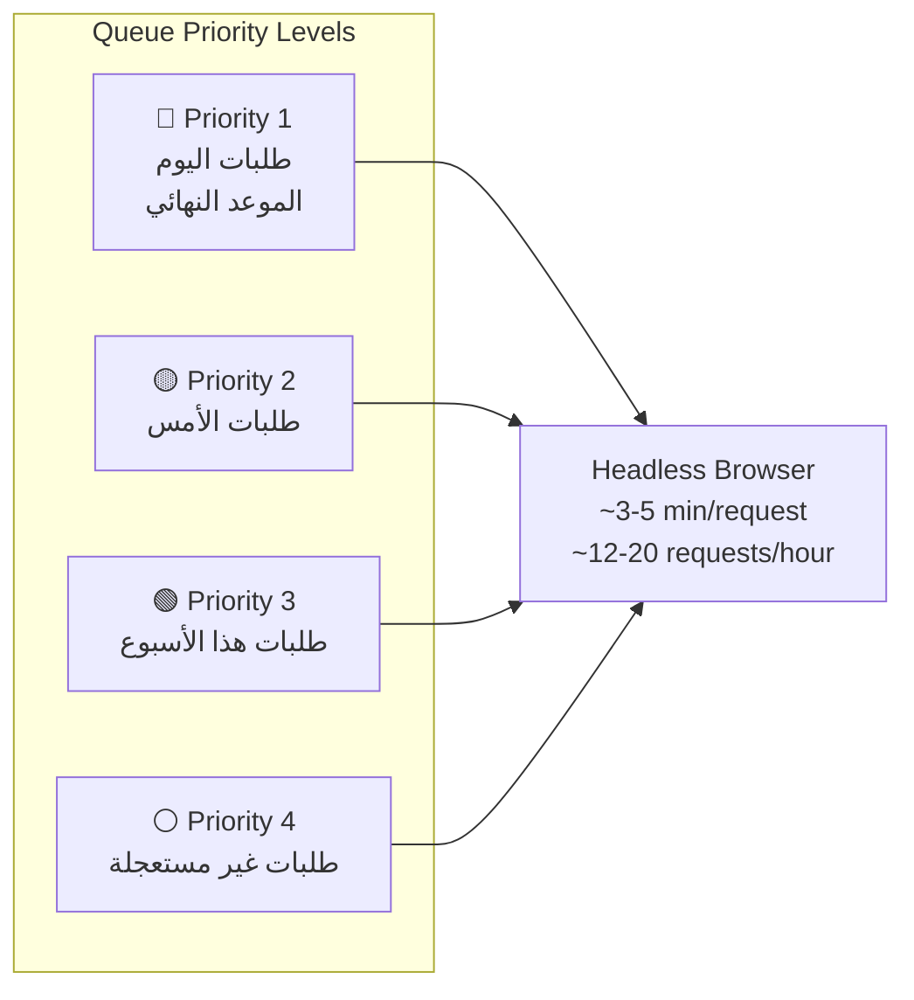

# التسجيل الرسمي في الموقع — Official Site Submission Deep Dive

## Qor3a — كيف نملأ نموذج travel.state.gov آلياً

---

## 1. الموقع الرسمي: dvprogram.state.gov

### 1.1 وصف التحدي

```
الإجراء حالياً:
├── الموظف يدخل بيانات العميل يدوياً
├── في موقع وزارة الخارجية الأمريكية
├── 5-10 دقائق لكل طلب
└── يحتاج CAPTCHA + VPN (قد يكون اليمن محظوراً)

هدف الأتمتة:
├── 🎯 Headless Browser (Puppeteer) يملأ النموذج
├── 🎯 2Captcha يحل CAPTCHA
├── 🎯 Proxy Rotation (لتجنب الحظر)
└── 🎯 Queue System (Bull) يدير الطلبات
```

---

## 2. هيكل نموذج التسجيل الرسمي

### 2.1 الـ Screens/Pages في الموقع الرسمي

بناءً على تحليل الموقع الرسمي لـ DV Lottery، النموذج يمر بعدة خطوات:


├── تاريخ الميلاد
├── الجنس
├── مكان الميلاد
├── الصورة الشخصية (إن وجد)
└── City of Birth

Screen 4: بيانات الأبناء — Children Information
├── لكل طفل: الاسم، تاريخ الميلاد، الجنس
├── يمكن إضافة حتى 20 طفل
└── Children Information (list, add/remove)

Screen 5: العنوان والبريد — Mailing Address
├── العنوان (سطر 1، سطر 2)
├── المدينة
├── المنطقة/الولاية
├── الرمز البريدي
├── الدولة
├── رقم الهاتف
├── الإيميل
└── تأكيد الإيميل

Screen 6: الصورة — Photo Review
├── عرض الصورة المرفوعة
├── تأكيد أنها تطابق المتطلبات
└── تحميل الصورة

Screen 7: المراجعة — Review & Submit
├── عرض كل البيانات
├── تعديل (إن لزم)
└── تأكيد الصحة

Screen 8: التأكيد — Confirmation
├── CAPTCHA
├── إرسال
└── Confirmation Number
```

### 2.2 حجم البيانات لكل طلب

```
├── ~50 حقل بيانات
├── 1-2 صورة شخصية (العميل + الزوج/الزوجة)
├── 0-20 طفل (كل طفل 4 حقول)
└── 1 Confirmation#
```

---

## 3. المعمارية التقنية للأتمتة

### 3.1 المكونات



### 3.2 Queue Priority


├── ~100-150 طلب/يوم (8 ساعات عمل)
└── ~700-1,000 طلب/أسبوع (مع加班 في الموعد النهائي)
```

---

## 4. استراتيجية CAPTCHA

### 4.1 أنواع CAPTCHA المحتملة

| النوع | احتمال ظهوره | الحل | التكلفة |
|-------|-------------|------|---------|
| reCAPTCHA v2 (checkbox) | عالي | 2Captcha — حل آلي | $0.002/حل |
| reCAPTCHA v3 (بدون تفاعل) | متوسط | Score-based، لا يحتاج حل | $0 |
| reCAPTCHA v2 (invisible) | عالي | 2Captcha — حل آلي | $0.002/حل |
| hCaptcha | منخفض | 2Captcha يدعمه | $0.002/حل |
| Image CAPTCHA (اختيار صور) | متوسط | 2Captcha + Manual Fallback | $0.01/حل |

### 4.2 التكلفة المقدرة لـ CAPTCHA

```
في الموسم:
├── ~2,000 طلب
├── CAPTCHA يظهر في 80% من الطلبات
├── = 1,600 CAPTCHA حل
├── التكلفة: 1,600 × $0.002 = $3.2
└── في ماي (الفحص): 1,000 × $0.01 = $10

المجموع السنوي لـ 2Captcha: ~$15-20
```

### 4.3 استراتيجية Proxy

```
لماذا Proxy؟
├── الموقع الرسمي قد يحظر IP بعد طلبات كثيرة
├── اليمن قد يكون محظوراً
└── الحل: مجموعة IPs من دول مختلفة

قائمة الـ Proxies:
├── 🇺🇸 US Proxy (أساسي) — 5 IPs
├── 🇹🇷 Turkey Proxy (احتياطي) — 2 IPs
├── 🇦🇪 UAE Proxy (احتياطي) — 2 IPs
└── 🇪🇬 Egypt Proxy (احتياطي) — 2 IPs

التكلفة: ~$20-30/شهر (خدمة Proxy راقية)
أو: $5-10/شهر (Proxy عادي + الـ US IPs)

استراتيجية التناوب:
├── كل 20 طلب → غير الـ IP
├── لو ظهر CAPTCHA → استخدم IP جديد
└── لو تكرر الحظر → توقف لمدة 30 دقيقة
```

---

## 5. تدفق الـ Headless Browser

### 5.1 الـ Script الكامل (نظرة عامة)

```javascript
// headless/submit-order.js
async function submitOrder(orderData, proxy) {
  const browser = await puppeteer.launch({
    args: [`--proxy-server=${proxy}`],
    headless: true // أو false للـ debugging
  })

  const page = await browser.newPage()

  try {
    // 1. افتح الموقع الرسمي
    await page.goto('https://dvprogram.state.gov/', { waitUntil: 'networkidle2' })

    // 2. اختر "New Entry"
    await page.click('#new-entry-button')
    await page.waitForSelector('#entry-form')

    // 3. املأ البيانات الأساسية
    await fillPersonalData(page, orderData.personal)

    // 4. تابع للصفحة التالية
    await page.click('#next-step')
    await page.waitForSelector('#spouse-section')

    // 5. املأ بيانات الزوج/الزوجة (إن وجد)
    if (orderData.spouse) {
      await fillSpouseData(page, orderData.spouse)
    }

    // 6. الأطفال (إن وجد)
    await page.click('#next-step')
    await page.waitForSelector('#children-section')
    if (orderData.children?.length) {
      for (const child of orderData.children) {
        await addChild(page, child)
      }
    }

    // 7. العنوان والإيميل
    await page.click('#next-step')
    await page.waitForSelector('#address-section')
    await fillAddress(page, orderData.address)

    // 8. الصورة
    await page.click('#next-step')
    await page.waitForSelector('#photo-section')
    await uploadPhoto(page, orderData.photoPath)

    // 9. المراجعة
    await page.click('#next-step')
    await page.waitForSelector('#review-section')

    // 10. CAPTCHA
    await solveCaptcha(page)

    // 11. إرسال!
    await page.click('#submit-button')
    await page.waitForSelector('#confirmation-number', { timeout: 30000 })

    // 12. استخراج Confirmation#
    const confirmationNumber = await page.evaluate(() => {
      return document.querySelector('#confirmation-number').textContent
    })

    return { success: true, confirmationNumber }
  } catch (error) {
    return { success: false, error: error.message }
  } finally {
    await browser.close()
  }
}
```

### 5.2 حالات الفشل المحتملة (وكيف نتعامل)

```
🚨 CAPTCHA غير قابل للحل:
├── → إعادة المحاولة مع Proxy جديد
├── → بعد 3 فشل: طابور يدوي

🚨 الموقع يظهر خطأ Validation:
├── → حفظ الـ Screenshot للخطأ
├── → إشعار للموظف للمراجعة اليدوية

🚨 الموقع Down:
├── → إعادة المحاولة بعد 30 دقيقة
├── → بعد 3 فشل: إشعار للمدير

🚨 Proxy محظور:
├── → إزالة الـ Proxy من القائمة
├── → اختيار Proxy جديد

🚨 انتهاء الجلسة (Session Expired):
├── → إعادة البدء من الصفر
└── → تسريع الإدخال (تقليل الوقت بين الخطوات)
```

---

## 6. استخراج النتائج (Result Checking — مايو)

### 6.1 الفرق عن التسجيل

```
التسجيل:         إدخال بيانات ← Confirmation#
فحص النتيجة:    أدخل Confirmation# ← نتيجة (فائز/خاسر)

الفحص أسهل بكثير:
├── فقط حقل واحد: الـ Confirmation#
├── اسم العائلة (Last Name)
├── سنة الميلاد (Year of Birth)
└── CAPTCHA
```

### 6.2 آلية الفحص

```
1️⃣ Queue كل الطلبات المقدمة (status = submitted)
2️⃣ لكل طلب: ندخل Confirmation# في الموقع
3️⃣ نجيب النتيجة: Selected / Not Selected
4️⃣ نحفظ النتيجة في الطلب

لو الموقع يلزم إدخال اسم العائلة وسنة الميلاد حماية:
├── نضيف الـ Last Name
├── نضيف سنة الميلاد
└── نبحث عن Confirmation# في الـ DB

حجم العمل (مايو):
├── 2,000 طلب → 2,000 فحص
├── 2Captcha لـ 80% = 1,600 حل
├── الوقت التقريبي: 3 أيام عمل
└── 15-20 طلب/ساعة × 12 ساعة/يوم × 3 أيام = 720 طلب
    ← الواقع يحتاج ~4-5 أيام
```

---

*التسجيل الرسمي بالتفصيل - يوليو 2026*
*قرعة (Qor3a) - منصة التسجيل في DV Lottery*
