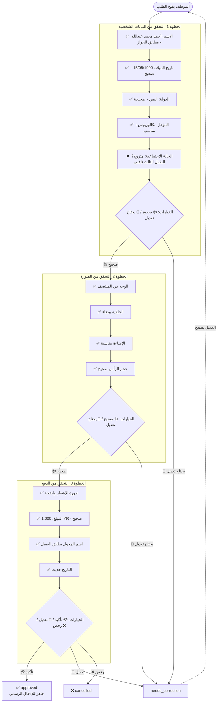

# تحليل عمليات الموظفين - Employee Operations Analysis

## Qor3a - Employee Role, Workflow & Daily Operations

---

## 1. من هو الموظف؟

**الموظف** (Employee) هو العمود الفقري للنظام. يقوم بكل العمليات التشغيلية اليومية.

### ماذا يفعل الموظف؟

| المهمة | الوصف | التكرار |
|--------|-------|---------|
| 📋 مراجعة الطلبات الجديدة | يفتح الطلب، يتحقق من البيانات والصورة والدفع | يومياً - أولوية |
| 💳 تأكيد الدفع | يتحقق من صورة الإشعار ويؤكد المبلغ | يومياً |
| 📝 إرسال ملاحظات للعميل | يكتب ملاحظات عندما يحتاج الطلب تعديلاً | عند الحاجة |
| 🌐 الإدخال الرسمي | يدخل بيانات العميل في الموقع الرسمي ويحصل على Confirmation# | يومياً |
| 📩 إرسال الإشعارات | يتأكد من وصول الإشعار للعميل | عند الإكمال |
| 🔍 فحص النتائج | يفحص نتائج العملاء في مايو | موسمي |

### ماذا لا يفعل الموظف؟

| المهمة | لماذا؟ |
|--------|--------|
| ❌ إضافة/حذف موظفين | صلاحية المدير فقط |
| ❌ تغيير أسعار الخدمات | صلاحية المدير فقط |
| ❌ رؤية تقارير الإيرادات | صلاحية المدير فقط |
| ❌ تعديل إعدادات النظام | صلاحية المدير فقط |
| ❌ حظر مستخدمين | صلاحية المدير فقط |

---

## 2. يوم الموظف - Daily Workflow

```mermaid
timeline
    title يوم الموظف - Employee Daily Workflow
    08:00 : فتح لوحة التحكم
           : 🔴 التحقق من الطلبات العالقة > 24 ساعة
    08:15 : مراجعة الطلبات الجديدة (Payment Verification)
           : ✅ تأكيد دفع → approved
           : 📝 يحتاج تعديل → يكتب ملاحظة للعميل
           : ❌ رفض → يكتب السبب
    09:30 : الإدخال الرسمي (Submit Confirmation#)
           : يفتح الطلبات المعتمدة (approved)
           : يدخل بيانات العميل في travel.state.gov
           : يحصل على Confirmation#
           : يسجله في النظام + إشعار للعميل
    12:00 : استراحة
    13:00 : متابعة الطلبات
           : ردود العملاء على طلبات التعديل
           : طلبات جديدة وصلت أثناء الاستراحة
           : متابعة الطلبات المعلقة
    16:00 : تقارير نهاية اليوم
           : كم طلب أتممت اليوم؟
           : كم Confirmation# سجلت؟
           : أي طلبات متبقية للغد؟
```

---

## 3. قائمة المهام (Task Queue)

### ما يراه الموظف عند فتح اللوحة

```
┌──────────────────────────────────────────────────────────────┐
│  📋 مهامي لليوم                                   15/09/2026│
├──────────────────────────────────────────────────────────────┤
│                                                              │
│  🔴 عاجل (معلق > 24 ساعة)                                   │
│  ┌──────────────────────────────────────────────────────┐   │
│  │  ⏳ طلب #DV-042 - أحمد محمد - بانتظار تأكيد الدفع   │   │
│  │     أرسل منذ 26 ساعة - لم يراجع بعد!               │   │
│  │  [📋 فتح الطلب]                                      │   │
│  └──────────────────────────────────────────────────────┘   │
│                                                              │
│  🟡 بانتظار المراجعة (جديدة)                                 │
│  ┌────┬──────────┬──────────────┬──────────┬──────────────┐│
│  │ #  │ العميل   │ الحالة       │ منذ      │ إجراء       ││
│  ├────┼──────────┼──────────────┼──────────┼──────────────┤│
│  │ 45 │ سارة علي │ 💳 دفع       │ 30 دقيقة │ [📋 مراجعة] ││
│  │ 46 │ خالد ع   │ 📸 صورة ✓   │ 1 ساعة   │ [📋 مراجعة] ││
│  │ 47 │ فاطمة أ  │ 💳 دفع       │ 2 ساعات  │ [📋 مراجعة] ││
│  └────┴──────────┴──────────────┴──────────┴──────────────┘│
│                                                              │
│  🟢 معتمد - بانتظار الإدخال الرسمي                           │
│  ┌────┬──────────┬──────────────┬──────────┬──────────────┐│
│  │ #  │ العميل   │ منذ          │ Conf#    │ إجراء       ││
│  ├────┼──────────┼──────────────┼──────────┼──────────────┤│
│  │ 40 │ أحمد م   │ معتمد 3 ساعات│ -        │ [🌐 إدخال]  ││
│  │ 41 │ محمد ص   │ معتمد 5 ساعات│ -        │ [🌐 إدخال]  ││
│  └────┴──────────┴──────────────┴──────────┴──────────────┘│
│                                                              │
│  🔵 يحتاج تعديل من العميل (بانتظار العميل)                  │
│  ┌────┬──────────┬──────────────┬──────────┬──────────────┐│
│  │ #  │ العميل   │ المشكلة      │ منذ      │              ││
│  ├────┼──────────┼──────────────┼──────────┼──────────────┤│
│  │ 38 │ أحمد م   | الصورة مرفوضة│ يومين    │ [متابعة]    ││
│  │ 39 │ سامي ر   | الدفعة ناقصة │ يوم      │ [متابعة]    ││
│  └────┴──────────┴──────────────┴──────────┴──────────────┘│
└──────────────────────────────────────────────────────────────┘
```

---

## 4. تدفق مراجعة الطلب - Order Review Flow (المهمة الأهم)

### 4.1 خطوات المراجعة



### 4.2 ماذا يحدث بعد كل إجراء؟

| الإجراء | الحالة الجديدة | ماذا يحدث |
|---------|---------------|-----------|
| **✅ اعتماد الطلب** | `approved` | ينتقل الطلب إلى قائمة "بانتظار الإدخال الرسمي" |
| **📝 يحتاج تعديل بيانات** | `needs_correction` | يرسل إشعار للعميل مع ملاحظة الموظف |
| **📝 صورة مرفوضة بشرياً** | `photo_rejected` | يرسل إشعار للعميل: "الصورة لا تطابق الشروط، أعد التقاطها" |
| **📝 مبلغ ناقص** | `needs_correction` | يرسل إشعار: "المبلغ المحول 500 YR، المطلوب 1,000 YR" |
| **❌ إشعار مزور** | `cancelled` | إشعار رفض + بلوك المستخدم (يتطلب تأكيد المدير) |
| **❌ بيانات غير صالحة** | `cancelled` | إشعار رفض مع السبب |

---

## 5. الإدخال الرسمي (Official Submission)

### 5.1 قبل الإدخال

```
⚠️ تنبيه: الإدخال الرسمي يتم يدوياً في موقع وزارة الخارجية
⚠️ لا يوجد API - الموظف يدخل البيانات بنفسه

ما يحتاجه الموظف:
├── 💻 جهاز كمبيوتر (يفضل) أو تابلت
├── 🌐 اتصال إنترنت مستقر
├── 🔒 VPN (إن كان الموقع محجوباً في اليمن)
├── 📸 الصورة الشخصية محفوظة على الجهاز
└── 📋 جميع بيانات العميل أمامك
```

### 5.2 خطوات الإدخال

```
1. الموظف يفتح الطلب في قرعة ← يضغط "🌐 فتح الموقع الرسمي"
    │
    ▼
2. يفتح travel.state.gov في نافذة جديدة (أو جهاز آخر)
    │
    ▼
3. يختار "DV Lottery Entry"
    │
    ▼
4. يدخل البيانات بالترتيب:
    ├── الاسم الكامل (First, Middle, Last)
    ├── تاريخ الميلاد
    ├── بلد الميلاد
    ├── الجنس
    ├── الصورة الشخصية (يرفعها من جهازه)
    ├── المؤهل التعليمي
    ├── الحالة الاجتماعية
    ├── بيانات الزوج/الزوجة (إن وجد)
    ├── بيانات الأبناء (إن وجدوا)
    ├── عنوان السكن
    ├── بريد إلكتروني
    └── رقم هاتف
    │
    ▼
5. ✔ يتأكد من كل حرف قبل الإرسال
    │
    ▼
6. يضغط Submit
    │
    ▼
7. 🎯 يحصل على Confirmation Number
    │
    ▼
8. يأخذ Screenshot أو يطبع صفحة التأكيد
    │
    ▼
9. يعود إلى قرعة ← يُدخل Confirmation#
    │
    ▼
10. يرفع Screenshot (اختياري)
    │
    ▼
11. 💾 حفظ ← إشعار فوري للعميل 🎉
```

### 5.3 أخطاء شائعة أثناء الإدخال الرسمي

| المشكلة | السبب | الحل |
|---------|-------|------|
| ❌ "Photo does not meet requirements" | الصورة مضغوطة أو معدلة | استخدم الصورة الأصلية من قرعة (غير معدلة) |
| ❌ "Session expired" | جلسة الموقع انتهت | سجل دخول مرة أخرى، ابدأ من جديد |
| ❌ "Country not eligible" | بلد الميلاد غير مؤهل | تحقق من قائمة البلدان المؤهلة |
| ❌ "Duplicate entry" | نفس الشخص مسجل مسبقاً | تأكد مع العميل |
| ❌ الموقع يعلق | ضغط على الخادم | حاول بعد ساعة |

---

## 6. التواصل مع العملاء (Client Communication)

### 6.1 متى يتواصل الموظف مع العميل؟

| الحالة | الرسالة | القناة |
|--------|---------|--------|
| 📝 يحتاج تعديل بيانات | "عزيزي العميل، الرجاء تعديل حقل الاسم ليطابق جواز السفر" | إشعار + واتساب |
| 📸 صورة مرفوضة | "الصورة لا تطابق الشروط. الخلفية غير بيضاء. الرجاء إعادة التصوير" | إشعار + واتساب |
| 💳 مبلغ ناقص | "المبلغ المحول 500 YR، المتبقي 500 YR" | إشعار + واتساب |
| ✅ اكتمل التسجيل | "🎉 تم تسجيلك بنجاح! رقم التأكيد: 2026AB1234567" | واتساب + إيميل |
| 🔍 فحص النتيجة | "🎉 مبروك! تم اختيارك في قرعة 2026!" أو "لم يتم اختيارك" | واتساب + إيميل |

### 6.2 نموذج رسالة "يحتاج تعديل"

```
📝 قرعة - طلب #DV-046

عزيزي/عزيزتي [اسم العميل]،

طلبك بحاجة لتعديل بسيط قبل أن نتمكن من إكمال التسجيل:

الخطأ: [الاسم لا يطابق جواز السفر]
المطلوب: [الاسم الكامل كما في الجواز]

الرجاء الدخول إلى حسابك وتعديل البيانات.
رابط الحساب: https://qor3a.com/my-account

بعد التعديل، سنراجع طلبك فوراً.

شكراً لثقتك بقرعة 🙏
```

---

## 7. أداء الموظف (Employee Performance)

### 7.1 كيف يُقاس أداء الموظف؟

| المؤشر | الهدف | كيفية القياس |
|--------|-------|-------------|
| ⏱ عدد الطلبات المنجزة يومياً | > 20 طلب/يوم | سجل الطلبات |
| ✅ دقة المراجعة | > 98% (أقل من 2% أخطاء) | أخطاء مكتشفة لاحقاً |
| ⏳ وقت الاستجابة | < 4 ساعات من استلام الطلب | وقت تغيير الحالة |
| 📝 عدد Confirmation# المدخلة | > 15/يوم | سجل الإدخال الرسمي |
| ⭐ رضا العملاء | > 90% تقييم إيجابي | استبيان بعد الخدمة |

### 7.2 لوحة أداء الموظف (يرى الموظف أداءه)

```
┌──────────────────────────────────────────────────────────────┐
│  📊 أدائي                                              15/09│
├──────────────────────────────────────────────────────────────┤
│                                                              │
│  ┌──────────┐  ┌──────────┐  ┌──────────┐  ┌──────────────┐│
│  │ 📋 50    │  │ ✅ 48    │  │ 📝 2     │  │ ⭐ 95%       ││
│  │ طلباً    │  │ مقبول    │  │ مرفوض    │  │ دقة          ││
│  │ راجعتها  │  │          │  │          │  │              ││
│  └──────────┘  └──────────┘  └──────────┘  └──────────────┘│
│                                                              │
│  إنجازات اليوم:                                              │
│  ├── راجعت 12 طلباً جديداً                                  │
│  ├── أكدت 8 دفعات                                           │
│  ├── أدخلت 10 Confirmation#                                 │
│  └── تواصلت مع 3 عملاء لتعديل بياناتهم                       │
│                                                              │
│  مقارنة: أنت في المرتبة 1 من 3 موظفين اليوم 🏆              │
└──────────────────────────────────────────────────────────────┘
```

### 7.3 أخطاء يجب على الموظف تجنبها

| الخطأ | العواقب | كيف تتجنبه |
|-------|---------|-----------|
| ❌ تأكيد دفع بمبلغ ناقص | خسارة مالية لقرعة | تأكد من المبلغ في صورة الإشعار |
| ❌ إدخال Confirmation# خاطئ | العميل يخسر فرصة اللوتري | تأكد من الرقم مرتين قبل الحفظ |
| ❌ الموافقة على صورة غير مطابقة | رفض الطلب من اللوتري | طابق الصورة مع شروط وزارة الخارجية |
| ❌ إرسال رسالة غير لائقة للعميل | سمعة سيئة لقرعة | كن مهنياً ومحترماً دائماً |

---

## 8. سيناريوهات وحالات خاصة (Edge Cases)

### السيناريو 1: عميل دفع المبلغ لشخص آخر (غلط في رقم الحساب)
```
المشكلة: العميل حول 1,000 YR لحساب خطأ
الإجراء:
├── الموظف يرى أن رقم الحوالة لا يطابق حسابات قرعة
├── يطلب من العميل التواصل مع كريمي لاسترداد المبلغ
├── يقدم رقم حساب قرعة الصحيح
└── يعيد العميل الحوالة
```

### السيناريو 2: Confirmation# ضاع أو لم يُحفظ
```
المشكلة: الموظف أدخل البيانات في الموقع الرسمي لكن النتائج لم تظهر
الإجراء:
├── تحقق من Session History في الموقع الرسمي
├── إن لم يوجد ← أعد إدخال البيانات
└── تأكد من الحفظ الفوري في قرعة بعد الإدخال
```

### السيناريو 3: عميل غير راضٍ عن الخدمة
```
المشكلة: العميل غاضب لأن الطلب تأخر
الإجراء:
├── استمع للشكوى بهدوء
├── اعتذر نيابة عن قرعة
├── قدم حل: "سننهي طلبك خلال ساعة"
└── إن لزم الأمر: حول الشكوى للمدير
```

### السيناريو 4: ازدواجية الطلب (نفس العميل سجل مرتين)
```
المشكلة: نفس العميل أنشأ طلبين بنفس البيانات
الإجراء:
├── أبقِ الطلب الأقدم (المدفوع) ← أكمله
├── ألغِ الطلب الأحدث
└── أرسل إشعار للعميل: "لديك طلب قيد المعالجة بالفعل"
```

---

## 9. قنوات التواصل المتاحة للموظف

| القناة | مع من | متى |
|--------|-------|-----|
| 📞 اتصال هاتفي | العميل | حالات الطوارئ (الدفع، الخطأ الجسيم) |
| 💬 واتساب | العميل | التواصل اليومي (تعديل، استفسار) |
| 📧 إيميل | العميل | التأكيد الرسمي (رقم التأكيد، الفوز) |
| 🔔 إشعار داخلي | العميل | إشعارات تلقائية (تغير الحالة) |
| 💬 شات داخلي | المدير | استفسارات داخلية عن الطلبات |
| 📋 ملاحظات الطلب | العميل | توثيق كل تواصل في سجل الطلب |

---

## 10. المهارات المطلوبة في الموظف

### المهارات الأساسية
- 📱 استخدام الحاسوب والإنترنت بطلاقة
- 📸 فهم شروط الصورة في DV Lottery
- 💰 دقة في التعامل مع المبالغ المالية
- 📝 كتابة بالعربية الفصحى المبسطة
- 🗣️ مهارات تواصل مع العملاء

### مهارات إضافية (يفضل)
- 🌐 إنجليزية متوسطة (الموقع الرسمي بالإنجليزية)
- 🔍 صبر ودقة في إدخال البيانات (الموقع الرسمي طويل)
- ⏰ إدارة وقت (في موسم الذروة)

---

## 11. API Endpoints الخاصة بالموظف

| Method | Endpoint | Description |
|--------|----------|-------------|
| GET | `/api/v1/employee/tasks` | قائمة مهام الموظف (مجمعة حسب الحالة) |
| GET | `/api/v1/employee/orders` | الطلبات الموكلة للموظف |
| GET | `/api/v1/employee/orders/:id` | عرض طلب مع كل التفاصيل |
| PATCH | `/api/v1/employee/orders/:id/status` | تغيير حالة الطلب (مع notes) |
| PATCH | `/api/v1/employee/orders/:id/payment/verify` | تأكيد/رفض الدفع |
| PATCH | `/api/v1/employee/orders/:id/submit` | إدخال Confirmation# |
| POST | `/api/v1/employee/orders/:id/notify` | إرسال إشعار للعميل |
| GET | `/api/v1/employee/performance` | إحصائيات أداء الموظف |
| PUT | `/api/v1/employee/profile` | تحديث الملف الشخصي |

---

*تحليل عمليات الموظفين - يوليو 2026*
*قرعة (Qor3a) - منصة التسجيل في DV Lottery*
