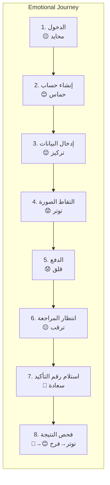

# تحليل تجربة وواجهة المستخدم (UI/UX Analysis)

## 1. User Journey Map - Client

### Journey: "أكمل تسجيلي في اللوتري من هاتفي في <5 دقائق"

| المرحلة | الشعور | نقاط الألم | الحل التقني |
|---------|--------|-----------|-------------|
| **1. الدخول** (30 ثانية) | فضول، أمل | لا يعرف من أين يبدأ | زر واحد "ابدأ التسجيل" في الصفحة الرئيسية، بدون تشويش |
| **2. إنشاء حساب** (45 ثانية) | حماس خفيف | يريد السرعة لا التعقيد | OAuth + OTP phone verification فوري |
| **3. إدخال البيانات** (90 ثانية) | تركيز | الحقول الكثيرة ترهقه | خطوة بخطوة (Step-by-step wizard)، حفظ تلقائي كل 10 ثوانٍ |
| **4. التقاط الصورة** (60 ثانية) | توتر | الخوف من رفض الصورة | إطار إرشادي مرئي، تغذية راجعة فورية من AI، إعادة محاولة سهلة |
| **5. الدفع** (60 ثانية) | قلق | لا يريد تعقيد الدفع | عرض واضح للحسابات، رفع صورة الحوالة مباشرة |
| **6. انتظار المراجعة** (متغير) | ترقب | لا يعرف ماذا يحدث | إشعارات فورية عند كل تغيير حالة |
| **7. استلام رقم التأكيد** (لحظي) | سعادة، ارتياح | يريد تأكيداً ملموساً | واتساب + إيميل + قابل للتحميل |
| **8. فحص النتيجة** (لحظي) | توتر، أمل | يخاف من عدم الفهم | ضغطة زر واحدة، نتيجة واضحة مع أيقونات |



---

## 2. Site Map (شجرة التنقل)

```mermaid
graph TB
    subgraph "بوابة الخدمات الإلكترونية"
        HOME["الصفحة الرئيسية"]
        AUTH["تسجيل الدخول / إنشاء حساب"]
        LOTTERY["خدمات اللوتري"]
        DASH["حسابي (Dashboard)"]
        ADMIN_L["لوحة المدير"]
        EMP_L["لوحة الموظف"]

        HOME -->|"دعوة لبدء التسجيل"| AUTH
        AUTH -->|"برقم الهاتف (OTP)"| LOTTERY

        subgraph "8-Step Wizard"
            LOTTERY --> S1["خطوة 1: اختيار الخدمة"]
            S1 --> S2["خطوة 2: البيانات الشخصية\nالاسم، التاريخ، الجنس..."]
            S2 --> S3["خطوة 3: الحالة الاجتماعية\nالزوج/الزوجة، الأبناء"]
            S3 --> S4["خطوة 4: معلومات الاتصال\nالبريد، الهاتف، العنوان"]
            S4 --> S5["خطوة 5: الصورة الشخصية\nAI Validation"]
            S5 --> S6["خطوة 6: الدفع\nإيداع يدوي + رفع إشعار"]
            S6 --> S7["خطوة 7: التأكيد"]
            S7 --> DASH
        end

        DASH -->|"الطلبات الحالية"| LOTTERY
        DASH -->|"الطلبات السابقة"| ADMIN_L
        EMP_L -->|"مراجعة الطلبات"| LOTTERY
    end
```


│   │   ├── إدخال رقم التأكيد يدوياً
│   │   └── اختيار طلب سابق للفحص الآلي
│   ├── المدفوعات
│   │   └── سجل المدفوعات لكل طلب
│   ├── الإشعارات
│   │   └── جميع الإشعارات (مقروءة/غير مقروءة)
│   └── الإعدادات
│       ├── تعديل الملف الشخصي
│       ├── تغيير كلمة المرور
│       └── إعدادات الإشعارات
│
├── لوحة الموظفين (Employee Dashboard)
│   ├── الطلبات
│   │   ├── كل الطلبات (مرشحة حسب الحالة)
│   │   ├── طلب واحد (عرض كامل)
│   │   │   ├── بيانات العميل
│   │   │   ├── الصورة + نتيجة AI
│   │   │   ├── إثبات الدفع
│   │   │   └── أزرار الإجراء:
│   │   │       ├── "قبول" (→ Approved)
│   │   │       ├── "يحتاج تعديل" (→ Needs_Correction)
│   │   │       └── "رفض" (→ Cancelled)
│   │   └── مراجعة الدفع
│   ├── الإدخال الرسمي (Submit)
│   │   └── بعد القبول: إدخال Confirmation#
│   └── فحص النتائج
│       └── اختيار طلب لفحص النتيجة
│
├── لوحة المدير (Admin Dashboard)
│   ├── الإحصائيات (Stats)
│   │   ├── إجمالي الطلبات
│   │   ├── الطلبات اليومية
│   │   ├── الإيرادات
│   │   └── توزيع الحالات
│   ├── إدارة المستخدمين
│   │   ├── بحث عن مستخدم
│   │   └── تعديل صلاحيات
│   ├── التقارير
│   │   ├── تقرير الطلبات (CSV/Excel)
│   │   └── تقرير الإيرادات
│   ├── سجل التدقيق (Audit Log)
│   └── الإعدادات
│       ├── تكلفة الخدمات
│       ├── حسابات الدفع
│       └── إعدادات API
│
└── صفحات عامة
    ├── من نحن
    ├── الشروط والأحكام
    ├── سياسة الخصوصية
    └── تواصل معنا
```

---

## 3. Key User Workflows (مسارات العمل الأساسية)

### Workflow A: التسجيل الكامل (Complete Registration) - الهدف <5 دقائق
```
ابدأ
  │
  ▼
[الصفحة الرئيسية]
  │  اضغط "ابدأ التسجيل"
  ▼
[تسجيل الدخول]
  │  أدخل رقم الهاتف ← OTP ← تأكيد
  ▼
[اختيار الخدمة: DV Lottery]
  │  اقرأ التنبيه ← وافق
  ▼
[البيانات الشخصية - Step 1/5]
  │  أدخل الاسم، تاريخ الميلاد، الدولة
  │  حفظ تلقائي ✓
  ▼
[الحالة الاجتماعية - Step 2/5]
  │  حدد الحالة ← أدخل بيانات الزوج/الأبناء (إن وجد)
  │  حفظ تلقائي ✓
  ▼
[معلومات الاتصال - Step 3/5]
  │  البريد الإلكتروني، الهاتف، العنوان
  │  حفظ تلقائي ✓
  ▼
[الصورة الشخصية - Step 4/5]
  │  اسمح بالكاميرا
  │  ضع وجهك في الإطار ← التقط
  │  ... جار التحقق (AI) ...
  │  ┌─ قبول ✓ ← استمر
  │  └─ رفض ✗ ← اقرأ السبب ← أعد التصوير
  ▼
[الدفع - Step 5/5] (إيداع في حسابات قرعة)
  │  اختر طريقة الدفع: كريمي / جيب / ون كاش / موبايل موني
  │  سيظهر رقم حساب قرعة ← حول المبلغ إليه
  │  ارفع صورة الإشعار (تصوير أو من المعرض)
  │  موظفنا سيتأكد يدوياً ويؤكد
  ▼
[التأكيد]
  │  رقم الطلب: #1234
  │  الحالة: قيد المراجعة
  │  (سنرسل لك إشعاراً فور اكتماله)
  ▼
نهاية (أقل من 5 دقائق ✅)
```

### Workflow B: فحص النتيجة (Result Check)
```
يدخل العميل إلى حسابه
  │
  ▼
يختار طلباً مكتملاً
  │
  ▼
يضغط "فحص النتيجة"
  │
  ▼
يدخل بيانات التحقق (أو يستخدم المحفوظة)
  │
  ▼
يُظهر النظام: "جارٍ الفحص..."
  │  (النظام الخلفي: Headless Browser → Official Site → CAPTCHA → Result)
  ▼
┌─────────────────────────────────────┐
│  النتيجة:                           │
│                                     │
│  🎉 مبروك! تم اختيارك 🎉           │
│  سنتواصل معك لاستكمال الإجراءات     │
│                                     │
│  أو                                │
│                                     │
│  لم يتم اختيارك هذا العام.          │
│  حظاً أوفر السنة القادمة.           │
└─────────────────────────────────────┘
  ▼
إشعار فوري للعميل (واتساب + إيميل)
```

### Workflow C: مراجعة الموظف (Employee Review)
```
يتسلم الموظف إشعاراً بطلب جديد
  │
  ▼
يفتح لوحة التحكم ← "بانتظار المراجعة"
  │
  ▼
يفتح الطلب:
  │  ┌─ البيانات الشخصية → يتحقق من صحتها
  │  ├─ الصورة → يتحقق من مطابقتها للشروط
  │  ├─ إثبات الدفع → يتحقق من تطابق المبلغ والحوالة
  │  └─ يقرر:
  │      ├─ "اعتماد" → ينتقل للـ Submitted
  │      ├─ "يحتاج تعديل" → يكتب ملاحظة ← يعيد للعميل
  │      └─ "رفض" ← يكتب السبب ← يُلغى الطلب
  ▼
(إذا اعتمد) يدخل Confirmation# من الموقع الرسمي
  │
  ▼
"تم التسجيل" → إشعار للعميل تلقائياً
```

---

## 4. Responsive Breakpoints & Device Strategy

| Device | Width | Strategy |
|--------|-------|----------|
| Mobile First | 320-480px | تصميم رأسي بخط كبير، أزرار واضحة، الكاميرا أولوية |
| Tablet | 768-1024px | تقسيم الشاشة لحقلين، عرض جانبي للمعاينة |
| Desktop | >1024px | لوحة الموظفين/المدير كاملة، إدارة متعددة النوافذ |

### Mobile Camera UI Priority
```
┌────────────────────────┐
│  × إلغاء              │
│                        │
│  ┌────────────────┐    │
│  │                │    │
│  │   ┌────────┐   │    │
│  │   │ وجهك   │   │    │
│  │   │ هنا    │   │    │
│  │   └────────┘   │    │
│  │                │    │
│  │    ○○○○○○○     │    │
│  └────────────────┘    │
│                        │
│  الإضاءة جيدة ✓        │
│  الخلفية بيضاء ✓       │
│  الوجه في المنتصف ✓    │
│                        │
│  ┌────────────────┐    │
│  │   التقاط الصورة │   │
│  └────────────────┘    │
└────────────────────────┘
```

---

## 5. Wireframe Sketches (مخططات الشاشات)

### Screen 1: Main Landing Page
```
┌──────────────────────────────────┐
│  🏠  قرعة  |  دخول  |  تسجيل  │
├──────────────────────────────────┤
│                                  │
│  ┌────────────────────────────┐  │
│  │                            │  │
│  │  🎯  التسجيل في DV Lottery │  │
│  │  سهولة • سرعة • احترافية   │  │
│  │                            │  │
│  │  ⏱  يستغرق أقل من 5 دقائق │  │
│  │                            │  │
│  │  ┌────────────────────┐   │  │
│  │  │  🚀 ابدأ التسجيل   │   │  │
│  │  └────────────────────┘   │  │
│  │                            │  │
│  └────────────────────────────┘  │
│                                  │
│  ┌──────┐  ┌──────┐  ┌──────┐  │
│  │ 📸    │  │ ✅   │  │ 🔒   │  │
│  │AI Photo│  │Review│  │Secure│  │
│  └──────┘  └──────┘  └──────┘  │
│                                  │
│  [من نحن]  [الشروط]  [الخصوصية]  │
└──────────────────────────────────┘
```

### Screen 2: Photo Capture Screen
```
┌──────────────────────────────────┐
│  ← رجوع        الخطوة 4 من 5    │
├──────────────────────────────────┤
│                                  │
│  ┌────────────────────────────┐  │
│  │                            │  │
│  │      ┌──────────┐          │  │
│  │      │          │          │  │
│  │      │  ارفع    │          │  │
│  │      │  رأسك   │          │  │
│  │      │  قليلاً  │          │  │
│  │      │          │          │  │
│  │      └──────────┘          │  │
│  │                            │  │
│  └────────────────────────────┘  │
│                                  │
│  ● خلفية بيضاء                  │
│  ● إضاءة كافية                   │
│  ● وجه في الوسط                  │
│  ● بدون نظارات                   │
│  ● بدون ابتسام                   │
│                                  │
│  [📷 التقاط الصورة]              │
│  [📁 رفع من المعرض]             │
└──────────────────────────────────┘
```

### Screen 3: Photo Validation Result
```
┌──────────────────────────────────┐
│  ← رجوع        الخطوة 4 من 5    │
├──────────────────────────────────┤
│                                  │
│  ┌────────────────────────────┐  │
│  │                            │  │
│  │      ┌──────────┐          │  │
│  │      │  صورتك   │          │  │
│  │      │          │          │  │
│  │      │          │          │  │
│  │      └──────────┘          │  │
│  │                            │  │
│  └────────────────────────────┘  │
│                                  │
│  ❌ الصورة مرفوضة                │
│                                  │
│  الأسباب:                       │
│  🟡 الخلفية غير بيضاء تماماً    │
│  🟢 مركز الوجه ✔                │
│  🟢 حجم الرأس ✔                 │
│  🟡 الإضاءة غير كافية           │
│  🟢 وضوح الصورة ✔               │
│                                  │
│  [🔄 إعادة التقاط الصورة]       │
└──────────────────────────────────┘
```

### Screen 4: Client Dashboard
```
┌──────────────────────────────────┐
│  مرحباً أحمد  |  🔔 (2) |  ⚙️   │
├──────────────────────────────────┤
│                                  │
│  ملخص طلباتي                     │
│                                  │
│  ┌────────────────────────────┐  │
│  │ طلب #DV-2026-001           │  │
│  │ 📅 2026-05-15              │  │
│  │                            │  │
│  │ 🟢 مكتمل ✓                 │  │
│  │ رقم التأكيد: 2026AB1234567 │  │
│  │                            │  │
│  │ [📋 عرض التفاصيل] [🔍 فحص النتيجة] │
│  └────────────────────────────┘  │
│                                  │
│  ┌────────────────────────────┐  │
│  │ طلب #DV-2026-002           │  │
│  │ 📅 2026-09-20              │  │
│  │                            │  │
│  │ 🟡 بانتظار مراجعة الدفع     │  │
│  │                            │  │
│  │ [📋 عرض التفاصيل]          │  │
│  └────────────────────────────┘  │
│                                  │
│  ┌────────────────────────────┐  │
│  │ 🆕 طلب جديد                 │  │
│  └────────────────────────────┘  │
└──────────────────────────────────┘
```

### Screen 5: Employee Review Screen
```
┌──────────────────────────────────┐
│  ← الرئيسية  |  طلب #DV-2026-001│
├──────────────────────────────────┤
│                                  │
│  ┌──────────┐  ┌──────────────┐ │
│  │ 📸 الصورة│  │ 👤 أحمد محمد │ │
│  │  AI: مقبولة│  │ 📅 15/05/1990│ │
│  │  ✓ 95%   │  │ 🌍 اليمن     │ │
│  └──────────┘  │ 💍 متزوج     │ │
│                │ 👶 2 أبناء   │ │
│                └──────────────┘ │
│                                  │
│  ┌────────────────────────────┐  │
│  │ 💳 إثبات الدفع             │  │
│  │ المبلغ: $20                │  │
│  │ الطريقة: كريمي             │  │

│  │ رقم الحوالة: 123456789     │  │
│  │ [عرض صورة الإشعار]         │  │
│  └────────────────────────────┘  │
│                                  │
│  ┌────────────────────────────┐  │
│  │ الإجراء:                   │  │
│  │                            │  │
│  │ [✅ اعتماد]                 │  │
│  │ [📝 يحتاج تعديل]           │  │
│  │ [❌ رفض]                   │  │
│  │                            │  │
│  │ الملاحظات:                 │  │
│  │ ┌──────────────────────┐   │  │
│  │ │ الصورة مقبولة،        │   │  │
│  │ │ البيانات صحيحة        │   │  │
│  │ └──────────────────────┘   │  │
│  └────────────────────────────┘  │
└──────────────────────────────────┘
```
