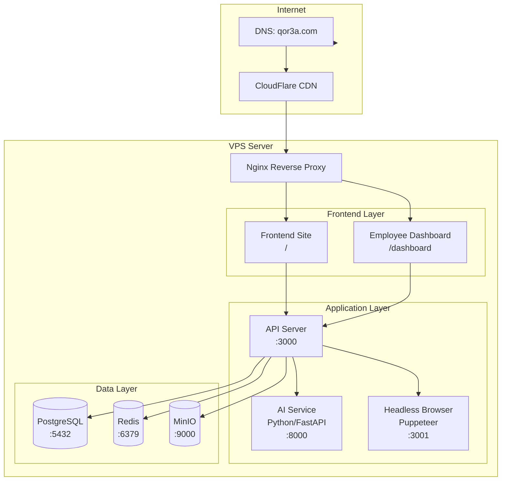

# تحليل البنية التحتية والنشر - Infrastructure & Deployment

## Qor3a - System Architecture, Hosting & Operations

---

## 1. نظرة عامة على البنية التحتية



---

## 2. البيئات (Environments)

### 2.1 ثلاث بيئات

| البيئة | الرابط | الاستخدام | الـ Database |
|--------|--------|-----------|-------------|
| **Development** | localhost:3000 | التطوير اليومي | PostgreSQL محلي |
| **Staging** | staging.qor3a.com | اختبار قبل الإطلاق | PostgreSQL مستقل |
| **Production** | qor3a.com | الإطلاق الفعلي | PostgreSQL مخصص + Backup |

### 2.2 Development Environment (محلي)

```
المبرمج يحتاج فقط:
├── 📦 Node.js 20+
├── 🐘 PostgreSQL (محلي)
├── 📦 Redis (محلي أو Docker)
└── 🐳 Docker (اختياري لـ MinIO)

التشغيل:
  backend/api/    → npm run dev    → :3000
  frontend/       → npm run dev    → :5173
  infra/          → docker-compose up -d → Redis + MinIO
```

### 2.3 Production Environment (الإنتاج)

```
السيرفر: VPS واحد قوي (أو 2 سيرفرات)
├── 💻 8 vCPU + 16GB RAM + 200GB SSD
├── 🐳 Docker + Docker Compose
├── 🌐 Nginx (Reverse Proxy + SSL)
├── 🐘 PostgreSQL
├── 📦 Redis
├── 🗄️ MinIO
└── 🚀 PM2 (مراقبة العمليات)

التكلفة الشهرية: ~$40-80 (DigitalOcean / Hetzner / محلي)
```

---

## 3. اختيار مزود الاستضافة (Hosting Options)

### 3.1 الخيارات المتاحة للسوق اليمني

| المزود | السعر الشهري | الموقع | مميزات | عيوب |
|--------|-------------|--------|--------|------|
| **Hetzner** | ~$8-40 | ألمانيا | أرخص، أداء عالي، موثوق | يدوي (لا تذاكر سريعة) |
| **DigitalOcean** | ~$12-48 | أمريكا/أوروبا | سهل، واجهة رائعة، دعم جيد | أغلى من Hetzner |
| **VPS محلي (يمن)** | ~$15-30 | اليمن | سرعة وصول عالية داخل اليمن | قد لا يكون مستقراً |
| **AWS Lightsail** | ~$10-40 | أقرب منطقة | AWS Ecosystem | معقد للمبتدئين |

### 3.2 التوصية

```
المرحلة الأولى (MVP):
├── 💻 Hetzner CX31 (~$12/شهر)
│   4 vCPU, 8GB RAM, 160GB SSD
│   يكفي لـ 300-500 طلب موسمي
│
المرحلة الثانية (نمو):
├── 💻 Hetzner CX41 (~$24/شهر)
│   8 vCPU, 16GB RAM, 240GB SSD
│   يكفي لـ 1000+ طلب
│
مع CDN: CloudFlare (مجاني)
```

---

## 4. الـ Domain والشهادات

### 4.1 ما تحتاجه

```
├── 🌐 Domain: qor3a.com (أو .net, .org)
│   التكلفة: ~$10-15 سنوياً
│   المسجل: Namecheap / Cloudflare / محلي
│
├── 📧 Professional Email: info@qor3a.com
│   (أو Gmail Workspace: $6/شهر)
│
└── 🔒 SSL: CloudFlare (مجاني - تلقائي)
```

### 4.2 إعدادات DNS

```
qor3a.com          → A Record → [IP السيرفر]
www.qor3a.com      → CNAME → qor3a.com
staging.qor3a.com  → A Record → [IP سيرفر الاستييج]
api.qor3a.com      → A Record → [IP السيرفر] (أو نفس السيرفر)
```

---

## 5. Docker في الإنتاج

### 5.1 هيكل Docker Compose للإنتاج

```yaml
version: "3.8"
services:
  nginx:
    image: nginx:alpine
    ports:
      - "80:80"
      - "443:443"
    volumes:
      - ./nginx.conf:/etc/nginx/nginx.conf
      - ./ssl:/etc/nginx/ssl
    depends_on:
      - backend-api

  backend-api:
    build: ./backend/api
    restart: always
    environment:
      NODE_ENV: production
      DB_HOST: postgres
      DB_PASSWORD: ${DB_PASSWORD}
    depends_on:
      - postgres
      - redis

  ai-service:
    build: ./backend/ai
    restart: always
    ports:
      - "8000:8000"

  postgres:
    image: postgres:16-alpine
    restart: always
    volumes:
      - pgdata:/var/lib/postgresql/data
    environment:
      POSTGRES_PASSWORD: ${DB_PASSWORD}

  redis:
    image: redis:7-alpine
    restart: always

  minio:
    image: minio/minio
    restart: always
    volumes:
      - miniodata:/data
```

### 5.2 أوامر الإدارة

```bash
# رفع الخدمات
ssh root@SERVER_IP
cd /opt/qor3a
docker compose pull
docker compose up -d

# مراقبة الـ logs
docker compose logs -f backend-api

# إعادة تشغيل خدمة
docker compose restart ai-service

# Backup قاعدة البيانات
docker exec qor3a-postgres pg_dump -U postgres qor3a > backup_$(date +%Y%m%d).sql
```

### 5.3 Nginx Config

```nginx
server {
    listen 80;
    server_name qor3a.com www.qor3a.com;
    return 301 https://$server_name$request_uri;
}

server {
    listen 443 ssl;
    server_name qor3a.com www.qor3a.com;

    ssl_certificate /etc/ssl/qor3a.crt;
    ssl_certificate_key /etc/ssl/qor3a.key;

    # Frontend (ملفات ثابتة)
    root /var/www/qor3a/frontend/dist;
    index index.html;

    # API
    location /api/ {
        proxy_pass http://backend-api:3000;
        proxy_set_header Host $host;
        proxy_set_header X-Real-IP $remote_addr;
    }

    # AI Service
    location /api/ai/ {
        proxy_pass http://ai-service:8000;
        proxy_set_header Host $host;
    }

    # S3 Storage (للصور)
    location /storage/ {
        proxy_pass http://minio:9000;
    }

    # SPA: كل المسارات ترسل لـ index.html
    location / {
        try_files $uri $uri/ /index.html;
    }
}
```

---

## 6. الـ CI/CD Pipeline

### 6.1 تدفق النشر

```
المبرمج
    │
    ├── git push origin main
    │
    ▼
GitHub / GitLab
    │
    ├── GitHub Actions / GitLab CI
    │
    ▼
اختبارات تلقائية
    ├── npm run lint
    ├── npm run test
    ├── npm run build
    │
    ▼
بناء Docker Image
    ├── docker build -t qor3a-api:latest .
    │
    ▼
رفع الصورة
    ├── docker push registry/qor3a-api:latest
    │
    ▼
نشر على السيرفر
    ├── ssh server "docker compose pull && docker compose up -d"
    └── إشعار النجاح/الفشل (إيميل/تيليجرام)
```

### 6.2 GitHub Actions Workflow (مثال)

```yaml
name: Deploy Qor3a
on:
  push:
    branches: [main]
jobs:
  deploy:
    runs-on: ubuntu-latest
    steps:
      - uses: actions/checkout@v3
      - run: npm install && npm test
      - run: docker build -t qor3a-api .
      - run: |
          echo "${{ secrets.SSH_KEY }}" > key.pem
          ssh -i key.pem root@server "cd /opt/qor3a && docker compose pull && docker compose up -d"
```

---

## 7. Backup Strategy

### 7.1 ما يجب نسخه احتياطياً

| العنصر | الحجم التقريبي | التكرار | طريقة النسخ |
|--------|---------------|---------|------------|
| PostgreSQL Database | 50-500MB | يومياً (تلقائي) | pg_dump + حفظ في S3 |
| الصور (MinIO) | 1-10GB | أسبوعياً | rsync + S3 |
| ملفات الإعدادات | 1MB | مع كل commit | Git |
| Logs | 100MB-1GB | شهرياً | logrotate + حفظ آخر 30 يوم |

### 7.2 سكريبت Backup آلي

```bash
#!/bin/bash
# /opt/qor3a/scripts/backup.sh

BACKUP_DIR="/backups"
DATE=$(date +%Y%m%d)
DB_NAME="qor3a"
S3_BUCKET="s3://qor3a-backups"

# نسخ قاعدة البيانات
docker exec qor3a-postgres pg_dump -U postgres $DB_NAME | gzip > $BACKUP_DIR/db_$DATE.sql.gz

# رفع إلى S3 (MinIO)
aws s3 cp $BACKUP_DIR/db_$DATE.sql.gz $S3_BUCKET/

# حذف النسخ الأقدم من 30 يوماً
find $BACKUP_DIR -name "db_*.sql.gz" -mtime +30 -delete

# إشعار النجاح
curl -s -X POST "https://api.telegram.org/bot$TOKEN/sendMessage" \
    -d "chat_id=$CHAT_ID&text=✅ Backup completed: $DATE"
```

### 7.3 جدولة الـ Backup (Cron)

```bash
# /etc/cron.d/qor3a
0 3 * * * root /opt/qor3a/scripts/backup.sh          # يومياً 3 صباحاً
0 4 * * 0 root /opt/qor3a/scripts/backup-photos.sh    # أسبوعياً (الأحد)
```

---

## 8. الـ Monitoring والمراقبة

### 8.1 ما يجب مراقبته

| المقياس | الأداة | التنبيه عند |
|---------|--------|-------------|
| CPU/RAM/Disk | htop + netdata | استخدام > 80% |
| هل الموقع شغال؟ | UptimeRobot (مجاني) | أي انقطاع |
| الـ API Response Time | مدمج (Winston logs) | > 2 ثوانٍ |
| فشل AI Service | Health check endpoint | 3 فشل متتالي |
| فشل Queue | Bull Dashboard | تراكم > 100 طلب |
| SSL انتهاء | UptimeRobot | قبل 30 يوماً |

### 8.2 تنبيهات (Alerts)

```
قنوات التنبيه:
├── 📧 إيميل (للمدير)
├── 📱 تيليجرام (للفريق الفني)
└── 🔔 إشعار في لوحة التحكم

أمثلة التنبيهات:
├── 🔴 "الموقع لا يستجيب!" → إيميل + تيليجرام فوري
├── 🟡 "استخدام CPU 85%" → تيليجرام
├── 🟢 "تم الـ Backup بنجاح" → إيميل صباحي
└── ⚠️ "SSL سينتهي بعد 15 يوماً" → تذكير أسبوعي
```

---

## 9. خطة الطوارئ (Disaster Recovery)

### 9.1 سيناريوهات وحلول

| السيناريو | ماذا تفعل؟ | وقت الاسترجاع |
|-----------|-----------|---------------|
| 🚨 **انقطاع السيرفر** | تفعيل سيرفر احتياطي (Backup VPS) | 30-60 دقيقة |
| 💥 **تلف قاعدة البيانات** | استرجاع آخر Backup | 1-2 ساعات |
| 🐛 **Bug في الإصدار الجديد** | الرجوع للإصدار السابق (git revert) | 15 دقيقة |
| 📛 **اختراق أمني** | إيقاف الخدمة ← تغيير كل Passwords ← تحليل ← تشغيل | 4-24 ساعة |
| 🌐 **انقطاع الإنترنت في اليمن** | السيرفر في أوروبا يعمل عادي (فقط العملاء قد لا يصلون) | لا تأثير على الخدمة |
| 💸 **نفاد رصيد API (2Captcha)** | تفعيل الطابور اليدوي | لحظي |

### 9.2 قائمة التحقق للطوارئ (Checklist)

```
□ هل الـ Backup محدث؟ (يجب أن يكون < 24 ساعة)
□ هل لديك access إلى السيرفر الاحتياطي؟
□ هل تعرف آخر إصدار مستقر (git tag)؟
□ هل أرقام التواصل مع مزود الاستضافة محفوظة؟
□ هل لديك نسخة من الـ .env (config) في مكان آمن؟
```

---

## 10. التكلفة الشهرية التقديرية

| البند | السعر | ملاحظات |
|-------|-------|---------|
| VPS (Hetzner CX31) | ~$12 | 4 vCPU, 8GB, 160GB |
| Domain (.com) | ~$1.5 | $15/سنة |
| SSL | $0 | CloudFlare مجاني |
| 2Captcha API | $5-20 | خلال موسم الفحص فقط |
| WhatsApp API | $10-30 | حسب حجم الإرسال |
| SMTP (Email) | $0-5 | Gmail مجاني أو SendGrid |
| CloudFlare CDN | $0 | مجاني لموقع صغير |
| S3 Storage | $5-10 | MinIO محلي + S3 للـ Backup |
| **الإجمالي** | **~$35-80/شهر** | ($40,000-95,000 YR) |

---

## 11. خطة التوسع المستقبلية

```
المرحلة 1 (MVP): سيرفر واحد
├── كل الخدمات على VPS واحد
├── Docker Compose
└── يكفي لـ 500 طلب

المرحلة 2 (نمو): سيرفرين
├── Server 1: API + Frontend + AI
├── Server 2: Database + Redis + MinIO
├── Nginx Load Balancer
└── يكفي لـ 2000 طلب

المرحلة 3 (توسع): Kubernetes
├── 3+ خوادم
├── K8s Cluster
├── Auto-scaling
└── آلاف الطلبات
```

---

*تحليل البنية التحتية - يوليو 2026*
*قرعة (Qor3a) - منصة التسجيل في DV Lottery*
